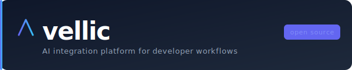

<p align="center">
  
</p>

<p align="center">
  <strong>Self-hosted AI pipelines for your dev workflow. Any VCS, any LLM, any automation you can describe.</strong>
</p>

<p align="center">
  <a href="https://github.com/vellic-ai/vellic/actions/workflows/ci.yml"></a>
  <a href="LICENSE"></a>
  <a href="https://github.com/vellic-ai/vellic/releases"></a>
  <a href="https://github.com/vellic-ai/vellic/stargazers"></a>
  
</p>

<p align="center">
  <a href="#-start-here">Start here</a> ·
  <a href="#quick-start">Quick Start</a> ·
  <a href="#built-in-pipelines">Pipelines</a> ·
  <a href="#build-your-own">Build your own</a> ·
  <a href="docs/README.md">All docs</a> ·
  <a href="#roadmap">Roadmap</a>
</p>

---

## 🚀 Start here

**Vellic is a self-hosted platform for AI-powered developer automations.** Connect it to your VCS once — then run pre-built pipelines (like AI code review), author your own in YAML, or wire both to your team's LLM of choice. Your code, your models, your pipelines.

**What you can do with it:**

- Ship **AI code review** on every PR out of the box — the flagship built-in pipeline.
- Run **PR summaries**, **issue triage**, **CI-failure explanations**, and **doc-drift detection** as optional built-ins.
- **Build your own pipeline** by dropping a YAML file in your repo: pick a trigger (webhook, cron, manual), chain stages (fetch context, call an LLM, post a comment, open an issue), deploy.
- Keep everything on your infrastructure — every LLM provider is pluggable, and a one-flag overlay or your own Ollama instance keeps the whole pipeline on-prem.

**Who it's for:**

- Engineering teams who want AI leverage on everyday repo chores without sending code to a SaaS platform.
- Teams who want to choose which LLM handles their code (on-prem or BYOK cloud).
- Teams who want to extend AI behaviour with their own pipelines, prompts, and tools — not only what the vendor ships.

**30-second quickstart:**

```bash
git clone https://github.com/vellic-ai/vellic.git && cd vellic
cp .env.example .env          # fill in the three required vars below
# Required: set a Postgres password
# POSTGRES_PASSWORD=changeme
# Required: webhook HMAC secret
# GITHUB_WEBHOOK_SECRET=$(openssl rand -hex 32)
# Required: Fernet key for encrypting secrets at rest
# LLM_ENCRYPTION_KEY=$(python -c 'from cryptography.fernet import Fernet; print(Fernet.generate_key().decode())')
docker compose up --build -d  # boot the full stack
bash scripts/health-check.sh  # confirm all services are healthy
```

Open **http://localhost** and finish setup in the Admin UI — create your password, then pick an LLM provider under **Settings → LLM Provider**. The stack does not bundle an LLM; for a fully local setup either enable the optional Ollama overlay (`docker compose -f docker-compose.yml -f docker-compose.ollama.yml up -d`) or point Vellic at an Ollama instance you already run. Then point your GitHub webhook at `https://<your-host>/webhook/github`, open a PR, and the **code review** pipeline runs immediately. Enable more pipelines (or add your own) from the Admin UI.

**Where to go next:**

- Full install walkthrough → [docs/quickstart.md](docs/quickstart.md)
- Connect a different VCS → [docs/vcs-integrations.md](docs/vcs-integrations.md)
- Switch to a cloud LLM → [docs/llm-providers/byok.md](docs/llm-providers/byok.md)
- Browse all docs → [docs/README.md](docs/README.md)

---

## Highlights

- **[Pipeline engine](docs/architecture.md)** — every automation is a pipeline: trigger → stages → outputs. The same runtime powers code review and anything you build yourself.
- **[Build-your-own pipelines](docs/prompt-dsl.md)** — drop `.vellic/pipelines/*.yaml` in your repo. Compose stage primitives (`fetch_diff`, `fetch_issue`, `fetch_ci_logs`, `llm_call`, `post_review`, `post_comment`, `open_issue`, …) without writing Python.
- **[VCS-agnostic adapter](docs/vcs-integrations.md)** — normalises GitHub, GitLab, Bitbucket, and custom webhooks into one platform-agnostic event model. Adding a new platform is one file.
- **[LLM-agnostic registry](docs/llm-providers/index.md)** — Ollama (on-prem), OpenAI, Anthropic, Claude Code. Pick your provider in the Admin UI, no restart. Per-pipeline or per-repo model overrides. (vLLM: 🚧 coming soon)
- **[MCP / plugin stages](docs/plugins-mcp.md)** — attach MCP tool hosts or Python plugins as pipeline stages. Give your LLM real tools — linters, test runners, API clients — scoped per pipeline.
- **[Admin SPA](http://localhost:80)** — catalog of pipelines, run history, replay, per-repo enable/disable, live metrics, LLM config.
- **[Feature flags](docs/feature-flags.md)** — granular control over every pipeline, every stage, every adapter.
- **[Kubernetes-ready](docs/deployment/kubernetes.md)** — manifest-first, no Helm required. Worker HPA scales 1→10 replicas at 70% CPU.
- **Privacy-first by default** — every provider is opt-in from the Admin UI, and a one-flag Ollama overlay keeps the entire pipeline on-prem. Cloud LLM providers show an explicit warning before you save.

---

## Built-in pipelines

| Pipeline | Trigger | Status | What it does |
|---|---|---|---|
| **Code review** | `pull_request` opened/synchronize | ✅ Shipped | Posts structured inline comments at the exact changed lines via the VCS Reviews API. |
| **PR summary** | `pull_request` opened | 🚧 Near-term | Drafts a structured PR description (what changed, why, risk notes) and keeps it updated on push. |
| **Issue triage** | `issues` opened | 🚧 Near-term | Suggests labels, severity, assignees; asks clarifying questions when the report is thin. |
| **CI-failure explainer** | `workflow_run` failure | 🚧 Near-term | Reads the failing logs, posts a comment explaining the likely cause and a suggested fix. |
| **Doc-drift detector** | `pull_request` opened | 🚧 Medium-term | Flags when code changes reference docs that were not updated in the same PR. |
| **Stale-issue sweeper** | cron (`@weekly`) | 🚧 Medium-term | Walks open issues, summarises activity, nudges or closes stale ones by policy. |

Every built-in is shipped as a YAML file you can fork, disable, or rewrite — there is no "magic" version that only the vendor can edit.

---

## Build your own

Pipelines live in your repo under `.vellic/pipelines/`. Example — an opinionated PR-summary pipeline:

```yaml
# .vellic/pipelines/pr-summary.yaml
name: pr-summary
trigger:
  on: pull_request
  actions: [opened, synchronize]

stages:
  - id: ctx
    use: gather_context

  - id: diff
    use: fetch_diff
    with:
      max_lines_per_chunk: 500

  - id: summary
    use: llm_call
    with:
      prompt: .vellic/prompts/pr-summary.md
      inputs: [ctx, diff]
      max_tokens: 1500

outputs:
  - use: post_comment
    with:
      body: ${{ stages.summary.text }}
      kind: summary          # replaces prior summary comment, no duplicates
```

What you get:

- **Triggers**: `pull_request`, `issues`, `push`, `workflow_run` (CI), cron, manual-run-from-UI. (Future: IDE bridge, Slack slash commands.)
- **Stage primitives**: context gathering, diff/issue/CI-log fetchers, `llm_call` with prompts from `.vellic/prompts/`, and actions (`post_review`, `post_comment`, `open_issue`, `open_pr`, `slack_notify`).
- **Custom stages**: register an MCP tool host or a Python plugin and invoke it as `use: mcp.<tool>` or `use: plugin.<name>`.
- **Chaining**: one pipeline's output can trigger another (e.g. `code-review` passes its summary to a `changelog` pipeline on merge).

Full guide: [docs/prompt-dsl.md](docs/prompt-dsl.md) and [docs/rules-engine.md](docs/rules-engine.md). Custom tool integration: [docs/plugins-mcp.md](docs/plugins-mcp.md).

---

## How it looks

**Inline review comment posted directly in the PR:**

> _Screenshots will be added once captured from a live deployment — see [VEL-141](/VEL/issues/VEL-141)._

**Admin dashboard** (pipeline catalog, run history, provider config):

> _Screenshots will be added once captured from a live deployment — see [VEL-141](/VEL/issues/VEL-141)._

**Webhook → pipeline run → action, end to end:**

> _Screenshots will be added once captured from a live deployment — see [VEL-141](/VEL/issues/VEL-141)._

---

## Quick start

Runtime: **Docker ≥ 24 + Docker Compose v2**.

```bash
git clone https://github.com/vellic-ai/vellic.git
cd vellic
cp .env.example .env
# Edit .env and set three required variables:
#   POSTGRES_PASSWORD=<any password>
#   GITHUB_WEBHOOK_SECRET=$(openssl rand -hex 32)
#   LLM_ENCRYPTION_KEY=$(python -c 'from cryptography.fernet import Fernet; print(Fernet.generate_key().decode())')
docker compose up --build -d            # build images and boot the stack
bash scripts/health-check.sh            # verify all services are healthy
```

All services respond `{"status": "ok"}` when ready:

```
http://localhost:8000/health   api       webhook ingestion
http://localhost:8001/health   admin     REST API for the SPA
http://localhost:8002/health   worker    async pipeline runner
http://localhost:80            frontend  admin SPA (nginx)
```

### Accessing the admin panel

Open **http://localhost:80** in your browser. On first launch you will be prompted to set an admin password.

| Page | URL | What it does |
|---|---|---|
| Dashboard | `/dashboard` | Live metrics — runs/24h, latency p50/p95, failure rate |
| Pipelines | `/pipelines` | Catalog — enable/disable, view definitions, inspect runs |
| Deliveries | `/deliveries` | Inbound webhooks, status, replay any delivery |
| Jobs | `/jobs` | Pipeline runs — status, duration, error logs |
| Providers | `/settings` | Configure LLM provider, model, API key, base URL |
| Repositories | `/repos` | Per-repo model and pipeline overrides |
| Feature flags | `/settings` | Toggle pipelines, adapters, LLM providers |

Point your VCS webhook at `https://<your-host>/webhook/<platform>`. Full setup: [VCS Integrations](docs/vcs-integrations.md).

---

## Supported platforms

<table>
<tr>
<td valign="top">

**VCS**

| Platform | Status |
|---|---|
| GitHub | ✅ Supported |
| GitLab | ✅ Supported |
| Bitbucket | 🚧 Alpha (feature flag) |
| Gitea / Forgejo | 🚧 Alpha (feature flag) |
| Custom webhook | ✅ One-file adapter |

</td>
<td valign="top">

**LLM**

| Provider | On-prem | BYOK |
|---|---|---|
| Ollama | ✅ | — |
| vLLM | 🚧 Soon | — |
| OpenAI | — | ✅ |
| Anthropic | — | ✅ |
| Claude Code CLI | Partial | ✅ |
| Custom OpenAI-compatible | ✅ | ✅ |

</td>
</tr>
</table>

---

## vs the alternatives

Vellic sits between three adjacent categories: agentic AI developer tools, CI+AI glue, and single-purpose AI code-review SaaS. It's the only one that's self-hostable, multi-pipeline, and open.

| | vellic | Copilot Workspace / Devin | GitHub Actions + AI scripts | CodeRabbit / Greptile |
|---|:---:|:---:|:---:|:---:|
| Self-host (your infra, your data) | ✅ | ❌ | Partial (CI host) | ❌ |
| VCS-agnostic (GitHub + GitLab + custom) | ✅ | ❌ | Partial | GitHub only |
| LLM-agnostic (swap provider freely) | ✅ | ❌ | DIY | ❌ |
| BYOK (bring your own API key) | ✅ | ❌ | ✅ | ⚠️ |
| Multi-workflow (review + summaries + triage + custom) | ✅ | Agent-only | DIY per-repo | Review-only |
| Pipelines-as-data (`.yaml` in your repo) | ✅ | ❌ | ✅ | ❌ |
| Plugin / MCP tool host | ✅ | Built-in only | DIY | ❌ |
| On-prem LLM (Ollama; vLLM soon) | ✅ | ❌ | DIY | ❌ |
| Open source | ✅ MIT | ❌ | N/A | ❌ |

The trade-off: you host and operate it yourself. If you want a hosted agent that picks up tickets without setup, pick Copilot Workspace. If you want a zero-config review SaaS, pick CodeRabbit. If you want repo-aware AI automations you own end-to-end, pick Vellic.

---

## Configuration

Three variables are required. Everything else has a sensible default or is configured through the **Admin UI**.

```dotenv
POSTGRES_PASSWORD=changeme
GITHUB_WEBHOOK_SECRET=<openssl rand -hex 32>
LLM_ENCRYPTION_KEY=<python -c 'from cryptography.fernet import Fernet; print(Fernet.generate_key().decode())'>
```

`LLM_ENCRYPTION_KEY` is a Fernet symmetric key used to encrypt secrets at rest (LLM API keys, VCS tokens, webhook HMACs). Without it, any attempt to save credentials in the Admin UI will return HTTP 503.

LLM provider, model, API keys, and per-repo settings are configured in the Admin SPA — not in `.env`. Full reference: [docs/configuration.md](docs/configuration.md)

---

## Repository layout

```
vellic/
├── api/          Webhook ingestion (FastAPI, port 8000)
├── worker/       Pipeline runtime (Arq, port 8002)
│   └── app/
│       ├── pipeline/   Stage graph executor + stage primitives
│       ├── llm/        Provider registry + adapters
│       └── adapters/   VCS platform adapters (webhook → event model)
├── admin/        Admin API (FastAPI, port 8001) — auth, stats, settings, pipelines, delivery replay
├── frontend/     Admin SPA (Vite + React + TypeScript) — served by nginx on port 80
├── packages/     Shared packages (vellic_flags, vellic_plugins)
├── infra/k8s/    Kubernetes manifests + HPA
├── scripts/      Dev tooling (setup, health-check, test-webhook, e2e-local)
└── docs/         Detailed documentation (see docs/README.md)
```

---

## Documentation

| | |
|---|---|
| [Docs index](docs/README.md) | Full navigation — Start here → Install → Configure → Use → Extend → Deploy |
| [Quickstart](docs/quickstart.md) | Full install walkthrough — first config, first pipeline run |
| [Architecture](docs/architecture.md) | Pipeline runtime, webhook flow, LLM abstraction, async job runner |
| [VCS Integrations](docs/vcs-integrations.md) | GitHub, GitLab, Bitbucket, custom adapter guide |
| [LLM Providers](docs/llm-providers/index.md) | All backends, BYOK, privacy notes, adding a new provider |
| [Feature flags](docs/feature-flags.md) | Full flag catalog, ENV overrides, Admin UI toggle |
| [Prompt DSL](docs/prompt-dsl.md) | Per-repo prompts and pipeline definitions in `.vellic/` |
| [Rules engine](docs/rules-engine.md) | Repo routing rules, pipeline feature flags, LLM instructions |
| [Plugins & MCP](docs/plugins-mcp.md) | MCP server attachment, per-repo tools, plugin-backed stages |
| [Configuration](docs/configuration.md) | Full environment variable reference |
| [Deployment](docs/deployment/index.md) | Docker Compose, Kubernetes, Helm, bare-metal |
| [Security](docs/security/index.md) | Encrypted secrets, BYOK, threat model, hardening checklist |
| [Roadmap](#roadmap) | What is built and what is coming |
| [Contributing](docs/contributing.md) | Dev setup, code style, PR checklist |

---

## Troubleshooting

**Stack won't start**

```bash
docker compose logs --tail=50   # check which service is failing
bash scripts/health-check.sh    # confirm which services are healthy
```

Common causes: `POSTGRES_PASSWORD` not set in `.env`, port conflicts (8000/8001/8002/80 already in use), Docker version < 24.

**Webhooks not arriving**

- Check `http://localhost:80/deliveries` — if the delivery appears there, the issue is downstream in the pipeline.
- Confirm your webhook URL matches `https://<host>/webhook/github` (or `/gitlab`, `/bitbucket`).
- Verify the webhook secret matches `GITHUB_WEBHOOK_SECRET` in `.env`.
- Ensure the VCS platform can reach your host (ngrok or similar for local dev).

**Pipeline ran but no comments posted**

- Check `http://localhost:80/jobs` — look at the failed job's error log.
- Confirm the LLM provider is reachable: Admin UI → Settings → LLM Provider → test connection.
- If using Ollama via the optional overlay, wait for the model to finish pulling: `docker compose logs ollama`. (Not using the overlay? Check whatever host runs your Ollama instance.)

**Admin UI not loading**

- Confirm `VELLIC_ADMIN_V2=1` is set on the `admin` service in `docker-compose.yml`.
- Check `docker compose ps` — both `admin` and `frontend` services must be running.
- Hard-refresh your browser (`Ctrl+Shift+R`) to clear stale assets.

**LLM returns empty or garbled output**

- Check model name in Admin UI → Settings → LLM Provider.
- For Ollama via the overlay: run `docker compose exec ollama ollama list` to confirm the model is available. For an external Ollama host, run `ollama list` on that host.
- For cloud providers: verify your API key has sufficient quota.

**Worker crashes immediately**

- Check `DATABASE_URL` — it must match `POSTGRES_PASSWORD` and the postgres service name.
- Run `docker compose restart worker` after fixing env vars; no full rebuild needed.

**GitLab MRs not triggering pipelines**

- Ensure `GITLAB_WEBHOOK_SECRET` matches the token set in GitLab webhook settings.
- Check `GITLAB_BASE_URL` is set if using a self-managed GitLab instance.

**Bitbucket / Gitea webhooks not processed**

- These platforms are in alpha. Enable the feature flag first:
  `VELLIC_FEATURE_VCS_BITBUCKET=true` or `VELLIC_FEATURE_VCS_GITEA=true`.
- See [Feature flags](docs/feature-flags.md) and [VCS Integrations](docs/vcs-integrations.md).

**High latency or timeouts on large PRs**

- Large diffs can exceed the LLM's context window. Use a model with a larger context limit.
- Enable the `pipeline.context` flag selectively per repo via the Admin UI to reduce payload size.
- For Ollama, increase `OLLAMA_NUM_CTX` on your Ollama host (or in `docker-compose.ollama.yml` if you use the overlay).

---

## Roadmap

Vellic's mission: every repeated, context-heavy task in the software lifecycle should be a pipeline — one that *your* team can read, fork, and own.

### Now (v0.1 — shipped)

- [x] GitHub webhook ingestion with HMAC validation
- [x] GitLab MR integration
- [x] Async pipeline runtime (Arq-backed, Redis-queued, deduped)
- [x] 4 LLM provider adapters — Ollama, OpenAI, Anthropic, Claude Code (pick in the Admin UI; no LLM is bundled)
- [x] Code-review pipeline (the flagship built-in)
- [x] Prompt DSL — ship prompts alongside your code
- [x] Feature flags — per-repo, per-tenant control
- [x] DB-backed LLM config — per-repo provider overrides via Admin UI
- [x] Admin panel (event replay, job inspection, provider settings)
- [x] Kubernetes manifests with HPA

### Near-term — "Pipelines as a platform"

- [ ] **Config-driven pipeline engine** — refactor the hard-coded 4-stage runner into a generic stage-graph executor.
- [ ] **`.vellic/pipelines/*.yaml` loader** — read pipeline definitions from your repo; re-express code review as one of these.
- [ ] **Stage-primitive registry** — `fetch_diff`, `gather_context`, `llm_call`, `post_review`, `post_comment`, `open_issue`.
- [ ] **Pipelines page in the Admin UI** — catalog, per-repo enable, run history, YAML viewer.
- [ ] **PR-summary pipeline** — second built-in; proves the abstraction.
- [ ] **Issue-triage pipeline** — third built-in, first non-PR trigger.
- [ ] **Cron trigger** — scheduled pipelines (stale-issue sweeper, weekly doc audit).
- [ ] **Manual-run button** — trigger any pipeline from the Admin UI or CLI.
- [ ] **vLLM provider adapter** — self-hosted OpenAI-compatible inference.
- [ ] **Bitbucket PR integration** — alpha → stable.
- [ ] **Webhook retry / DLQ** — resilient delivery with exponential back-off.

### Medium-term

- [ ] **CI-failure explainer pipeline** — `workflow_run` trigger + log fetcher primitive.
- [ ] **Doc-drift pipeline** — detect code changes without matching doc updates.
- [ ] **MCP/plugin-backed stages** — `use: mcp.<tool>` / `use: plugin.<name>` in pipeline YAML.
- [ ] **Pipeline chaining** — one pipeline's output triggers another (e.g. review → changelog on merge).
- [ ] **Slack / Teams notifier primitive** — deliver pipeline output to team channels.
- [ ] **Multi-tenant mode** — per-organisation API keys, isolated pipelines.

### Long-term

- [ ] **IDE bridge** — run any pipeline against an open PR or branch from VS Code / JetBrains before opening the PR.
- [ ] **Slack slash-command trigger** — `/vellic review <PR>` and friends.
- [ ] **Metrics dashboard** — pipeline quality trends, LLM cost tracking, team velocity.
- [ ] **Pipeline marketplace** — share YAML pipelines between teams.

Full roadmap: [docs/roadmap.md](docs/roadmap.md)

---

## FAQ

**Does vellic work with private repositories?**
Yes. Vellic is self-hosted — it runs in your infrastructure and connects to your VCS platform via webhooks. It never touches GitHub.com / GitLab.com / Bitbucket.org directly; the diff (or issue, or CI log) is fetched from your VCS platform's API using the credentials you configure.

**Can I self-host the LLM too?**
Yes. Vellic itself does not bundle an LLM, but the repo ships an opt-in Ollama overlay (`docker compose -f docker-compose.yml -f docker-compose.ollama.yml up -d`) and you can always point at your own Ollama / vLLM / other OpenAI-compatible instance. Cloud providers (OpenAI, Anthropic) are available but opt-in, and the Admin UI shows an explicit warning before you save. vLLM support (OpenAI-compatible self-hosted inference) is coming soon.

**What data leaves my infrastructure?**
With an on-prem LLM (Ollama overlay or your own server): nothing. Repo data is fetched from your VCS, processed inside the worker container, and results are posted back. If you switch to a cloud LLM provider, whatever the pipeline sends to `llm_call` (diff, issue body, CI log) is sent to that provider's API — the Admin UI makes this explicit with a warning.

**How do I set up BYOK (Bring Your Own Key)?**
In the Admin UI: Settings → LLM Provider → select OpenAI / Anthropic → paste your API key → Save. The key is encrypted at rest with AES-256-GCM. See [docs/llm-providers/byok.md](docs/llm-providers/byok.md) for full details.

**Is code review the only thing Vellic does?**
No — it's the flagship built-in and the best-tested pipeline today. PR summaries, issue triage, CI-failure explanations, and doc-drift detection are on the near-term roadmap as additional built-ins, and you can author your own pipelines in `.vellic/pipelines/*.yaml`.

**Which VCS platforms are supported?**
GitHub and GitLab are fully supported. Bitbucket and Gitea are in alpha (enable via feature flag). Any platform that emits webhooks can be added with a single adapter file. See [docs/vcs-integrations.md](docs/vcs-integrations.md).

**Which LLM providers are supported?**
Ollama (local), OpenAI, Anthropic, and Claude Code CLI. vLLM (self-hosted OpenAI-compatible inference) is 🚧 coming soon. See [docs/llm-providers/index.md](docs/llm-providers/index.md).

**How much does it cost to run?**
With a self-hosted Ollama (via the optional overlay or your own server), there is zero LLM API cost — only your compute cost. With a cloud LLM, cost depends on each pipeline's token usage. A typical 200-line diff through the code-review pipeline costs ~$0.01–0.05 with GPT-4o or Claude Haiku. Enable heavier pipelines (doc-drift, CI-explainer) only for repos where the cost-benefit is clear.

**Can I customise what the LLM looks for?**
Yes — two layers. Prompts live in `.vellic/prompts/` (loaded automatically by any `llm_call` stage). Entire pipeline shapes live in `.vellic/pipelines/*.yaml`. See [docs/prompt-dsl.md](docs/prompt-dsl.md).

**Is there a hosted / cloud version?**
Not yet. Vellic is currently open-source self-hosted only. Multi-tenant mode is on the roadmap.

---

## Contributing

Pull requests are welcome. Highest-impact contributions right now:

- New stage primitives (e.g. `fetch_ci_logs`, `slack_notify`, `open_pr`).
- New built-in pipelines (YAML + prompts, no Python needed for most).
- New VCS adapters (Bitbucket stable, Forgejo).
- New LLM providers.

See [docs/contributing.md](docs/contributing.md) to get started.

---

## License

[MIT](LICENSE) © 2026 vellic-ai
